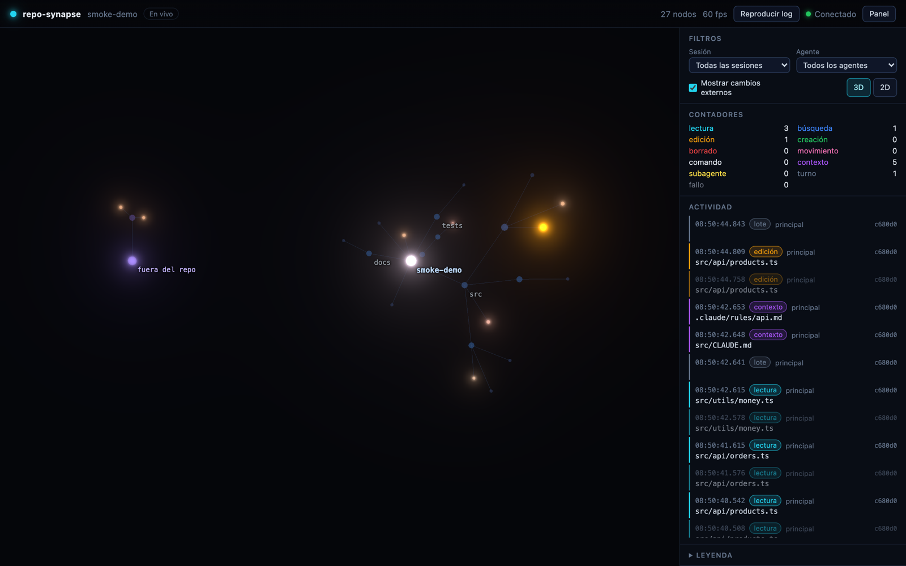
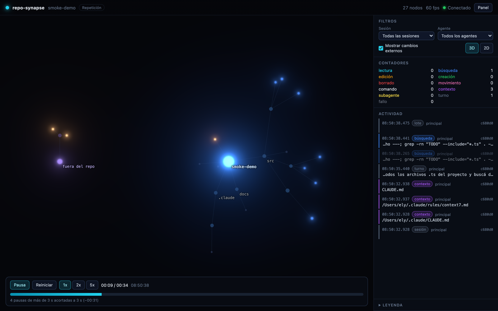

# repo-synapse

Vista 3D en vivo de lo que hace Claude Code dentro de un repositorio. Cada archivo y carpeta es un nodo. Cuando Claude lee, busca, edita, crea o borra algo, una luz viaja desde la raíz hasta ese archivo con el color de la acción.



Sirve para mirar cómo se mueve el agente: qué lee primero, cuánto explora antes de editar, qué instrucciones se cargan solas al contexto y qué hacen los subagentes.

## Requisitos

- Node 22.12 o superior (probado en 26).
- Claude Code con hooks HTTP. Probado con 2.1.285 en macOS arm64.
- git (opcional: sin git el árbol se arma recorriendo carpetas).

## Instalación

Todavía no está publicado en npm. Se instala desde este repo:

```bash
git clone <este repo> repo-synapse
cd repo-synapse
npm install
npm run build
npm link
```

`npm link` deja el comando `repo-synapse` disponible en cualquier carpeta. Para quitarlo: `npm unlink -g repo-synapse`.

## Uso en cualquier repositorio

```bash
repo-synapse start ~/ruta/a/mi-repo     # o `repo-synapse start` parado dentro del repo
```

Después abrí Claude Code en ese repo, como siempre. El navegador ya muestra la red y se ilumina con cada acción. `Ctrl+C` cierra el visor y deja todo como estaba.

| Comando | Qué hace |
|---|---|
| `repo-synapse start [repo]` | Levanta el servidor, instala los hooks mientras corre y abre el navegador |
| `repo-synapse replay [repo \| archivo.jsonl]` | Reproduce una sesión grabada |
| `repo-synapse doctor [repo]` | Revisa Node, hooks, allowlists, proxies y la interfaz compilada |
| `repo-synapse install [repo]` / `uninstall [repo]` | Instala o quita los hooks a mano (sirve para limpiar si el proceso murió de golpe) |

Opciones de `start`: `--port N` (7777 por defecto; si está ocupado usa el siguiente libre), `--strict-port`, `--no-open`, `--no-install`, `--no-bash-diff`.

La guía paso a paso con un repo de ejemplo y un prompt para probar está en [docs/DEMO.md](docs/DEMO.md).

## Qué toca en tu máquina

Mientras `start` corre:

1. Escribe hooks HTTP en `<repo>/.claude/settings.local.json`, que apuntan a `http://127.0.0.1:<puerto>/hook?src=repo-synapse`. Si ya tenías hooks ahí, los conserva. Si el archivo no existía, lo crea.
2. Activa `bashEditDiffEnabled` en `~/.claude/settings.json` (o en `$CLAUDE_CONFIG_DIR`). Con eso Claude Code informa qué archivos cambió cada comando Bash, y un `rm` o un `git mv` se atribuyen con exactitud. Si ya estaba activado, no lo toca. `--no-bash-diff` lo evita.
3. Crea `<repo>/.repo-synapse/` con el log de eventos y un lock. Esa carpeta y `settings.local.json` se agregan a `.git/info/exclude`, así que no aparecen en `git status`.

Al cerrar con `Ctrl+C` (o `SIGTERM`) quita sus hooks y revierte `bashEditDiffEnabled`. Si no hubo otros cambios, los archivos quedan iguales byte a byte. Si el proceso muere de golpe, `repo-synapse uninstall <repo>` limpia, y el próximo `start` corrige solo lo que haya quedado.

Los hooks existen solo mientras el visor corre por un motivo concreto: si Claude Code tiene un hook HTTP apuntando a un servidor apagado, cada herramienta imprime un `hook error` en rojo. Con el visor cerrado no queda ningún hook.

## Qué se ve

| Acción | Color |
|---|---|
| Lectura | cian |
| Búsqueda (`find`, `grep`, `rg`...) | azul |
| Edición | ámbar |
| Creación | verde |
| Borrado | rojo |
| Movimiento | rosa |
| Instrucciones cargadas (`CLAUDE.md`, `.claude/rules`) | violeta |
| Otro comando Bash | blanco |
| Fallo | gris con parpadeo |
| Cambio externo (hecho fuera de Claude) | gris tenue |

La fase previa de una herramienta (Claude decidió usarla) es un pulso tenue; la fase final (terminó) es el pulso completo. Cada subagente pone un halo de color propio alrededor de los nodos que toca. Los archivos fuera del repo, como tus skills en `~/.claude` o `/tmp`, aparecen en un cúmulo aparte. Los nodos más tocados conservan brillo (heatmap).

El panel lateral tiene el feed en vivo, contadores por acción, filtros por sesión y por agente, el interruptor de cambios externos y el cambio entre 3D y 2D. En repos de más de 1.500 nodos las carpetas se colapsan y se abren solas cuando Claude entra en ellas.



## Cómo funciona

```
Claude Code ──hook HTTP (POST)──▶ servidor 127.0.0.1 ──WebSocket──▶ navegador
                                      ▲         │
                  fs.watch recursivo ─┘         └──▶ .repo-synapse/events.jsonl
```

- El servidor responde `204` vacío antes de procesar, así Claude Code nunca espera ni recibe una decisión. Cada hook tiene `timeout: 2`.
- Normaliza cada payload a un evento con rutas relativas al repo. Nunca manda al navegador ni guarda en el log contenido de archivos (`content`, `old_string`, diffs, salida de comandos): solo rutas y metadatos.
- Un watcher (`fs.watch` recursivo, FSEvents en macOS) ve los cambios de disco. Si pasan dentro de la ventana de un comando Bash de Claude se le atribuyen; si no, se marcan como externos.

Los payloads reales que manda Claude Code 2.1.285 están documentados en [docs/PAYLOADS.md](docs/PAYLOADS.md). El plan está en [docs/IMPLEMENTATION_PLAN.md](docs/IMPLEMENTATION_PLAN.md) y las decisiones con sus motivos en [docs/DECISIONS.md](docs/DECISIONS.md).

## Desarrollo

```bash
npm run build        # interfaz (Vite) + CLI (tsdown) en dist/
npm run typecheck
npm test             # build + Vitest (servidor y web) + Playwright
npm run dev -- start ../otro-repo   # CLI desde src con tsx (usa la web de dist/)
```

La primera vez, Playwright necesita `npx playwright install chromium`.

## Limitaciones conocidas

- Solo se probó en macOS. En Linux `fs.watch` recursivo usa inotify y no está verificado.
- Si agregás los hooks con una sesión de Claude Code ya abierta, no está verificado que los tome sin reiniciar.
- Sin `bashEditDiff`, la atribución de `rm` y `mv` depende de ventanas de tiempo y del watcher; un `rm x; cp -p y z` puede mostrarse como un movimiento.
- Las sesiones de Claude Code en la web o en la nube no llegan a un servidor local.
