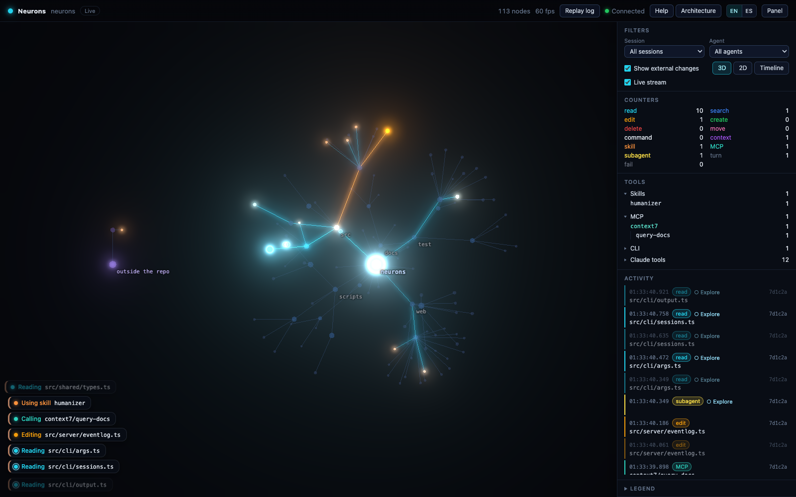

**English** · [Español](README.es.md)

# Neurons

Neurons shows what Claude Code does inside a repository, live. Run `neu` in a repo and your browser opens with the repository drawn as a network: every file and folder is a node. When Claude Code reads, searches, edits, creates or deletes something, a light travels to that file in the color of the action.



Use it to watch how the agent works: what it reads first, how much it explores before it edits, which instructions load on their own and what its subagents do. It runs on your machine and does not keep file contents: it stores paths, metadata and the Bash commands Claude ran, with what they write blanked out (a best-effort filter, see the [guide](docs/guide.html#faq-content)).

## Set it up with your AI

Open Claude Code in any folder and paste this prompt. Replace `<repo-url>` with the address you got Neurons from (a Git URL or a folder on your disk).

```text
Install the Neurons CLI (npm package neurons-cli) on this machine. Do these steps in order and stop to tell me if one fails.

1. Run `node --version`. Neurons needs Node 22.12 or later. If mine is older, stop and tell me how to update it; do not change my Node install yourself.
2. Clone the repository: `git clone <repo-url> ~/neurons`. If <repo-url> is still a placeholder, ask me for it. If ~/neurons already exists, ask me before touching it.
3. In ~/neurons run `npm install` and then `npm run build`. The build must leave a file at ~/neurons/dist/cli.mjs.
4. In ~/neurons run `npm link`. It puts two global commands on my PATH, `neu` and `neurons`, which are the same program. If it fails with EEXIST because another package already owns `neu`, tell me which package it is and do not use --force without asking. If it fails with EACCES, explain my options instead of using sudo.
5. Check the install: `neu --version` must print a version, and `neu doctor` must run. Show me what doctor reports. A note that the hooks are not installed is expected at this point.
6. Tell me in two lines how to use it: cd into any repository and run `neu`, then open Claude Code in that same repository.

If I want the command to have another name, the names come from the "bin" field in ~/neurons/package.json. Changing a key there (for example "neu" to "nr") and running `npm unlink -g neurons-cli` and then `npm link` again does it. Ask me whether I want that before you change anything.
```

## Set it up by hand

You need Node 22.12 or later, git and Claude Code (tested with 2.1.285 and 2.1.288). Neurons is not on npm yet.

```bash
git clone <repo-url> ~/neurons
cd ~/neurons
npm install
npm run build
npm link            # adds the global commands neu and neurons
neu --version
neu doctor
```

To remove the commands: `npm unlink -g neurons-cli`. To use another name, change the keys under `"bin"` in `package.json` and link again.

## Use it

```bash
cd ~/projects/my-repo
neu                 # starts the viewer and opens http://127.0.0.1:7777
```

Then open Claude Code in that repo, in another terminal, as usual. A session that was already open picks up the hooks without a restart (verified with Claude Code 2.1.288 on macOS). If it shows no events, run `/reload-plugins` in it; if that is not enough, `/exit` and then `claude --continue`. `Ctrl+C`, or `neu stop` from any other terminal, closes the viewer and takes its hooks out.

| Command | What it does |
|---|---|
| `neu [repo]` | Starts the viewer for that repo (the current one by default) |
| `neu ls` | Lists the running viewers, one per repo, each on its own port |
| `neu open [repo]` | Opens a viewer's page again |
| `neu stop [repo]` | Closes a viewer; `--all` closes every one |
| `neu replay [repo]` | Replays a recorded session |
| `neu doctor [repo]` | Checks Node, the hooks and the settings |
| `neu uninstall [repo]` | Removes leftover hooks if a viewer died without cleaning up |
| `neu help` | Every command and option |

`neu` speaks the system language (English or Spanish); `--lang en` or `NEURONS_LANG=en` forces English.

## Guide and architecture

The [user guide](docs/guide.html) covers setup, daily use and a long FAQ: what each color means, sessions and subagents, replay, the Timeline, what Neurons touches on your machine, privacy and how to demo it safely. While the viewer runs it is also at `/help` on the viewer's address, in English and Spanish.

[How it works](docs/architecture.html) explains the hooks, the server and the page with animated diagrams (`/architecture` while the viewer runs). Design decisions and their reasons are in [docs/DECISIONS.md](docs/DECISIONS.md), and the real hook payloads in [docs/PAYLOADS.md](docs/PAYLOADS.md).

## Operating systems

Verified on macOS (Apple Silicon). Linux is expected to work but has not been run yet. Windows support is experimental and untested; the guide lists [the known limits](docs/guide.html#faq-os).

## Development

```bash
npm run build        # web page (Vite), CLI (tsdown) and docs into dist/
npm run typecheck
npm test             # build + Vitest (server and web) + Playwright
npm run dev -- start ../other-repo   # CLI from src with tsx
```

The docs pages' texts live in `docs/i18n/guide.{en,es}.json` and `docs/i18n/architecture.{en,es}.json`. After editing them, run `node scripts/sync-guide-i18n.mjs` so both pages also switch language when opened from disk.

If you used the earlier name, repo-synapse: run `npm unlink -g repo-synapse` before `npm link`. Its old hooks and logs are cleaned up or reused on their own (decision I28 in [DECISIONS.md](docs/DECISIONS.md)).

## License

MIT.
